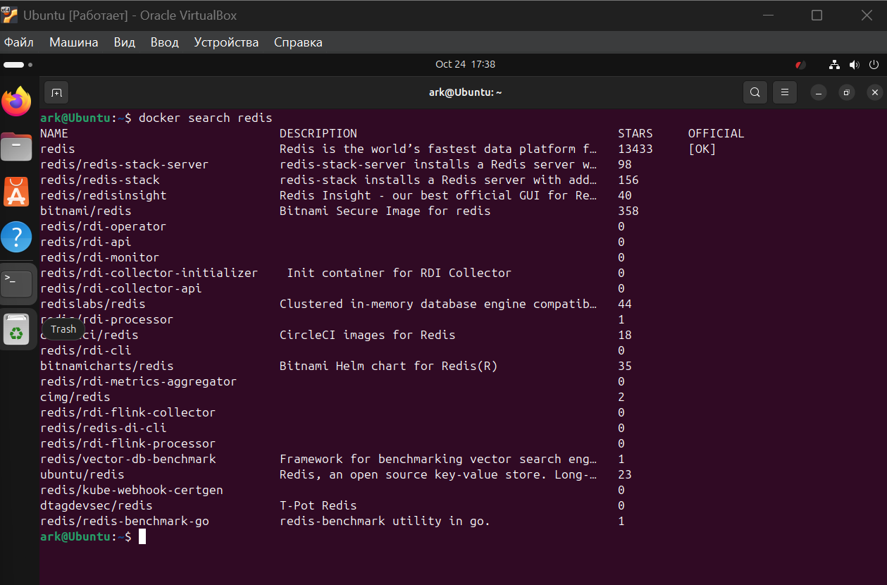

` sudo usermod -aG docker $USER ` - добавить пользователя в группу докер

`sudo systemctl status docker` - статус докера

`sudo systemctl start docker` - запуск докера

`docker ps` - проверка запущенных контейнеров

### 1. Поиск образа
`docker search redis`

### 2. Запуск в фоне
`docker run -d --name my-redis redis`

### 3. Проверка работающих контейнеров
`docker ps`

`docker ps -a` -все контейнеры

### 4. Инспекция и логи
`docker inspect my-redis`

`docker logs my-redis`

### 5. Запуск с пробросом порта
`docker run -d --name redis-with-port -p 6379:6379 redis:latest`

### 6. Запуск с томом для данных
`docker run -d --name redis-with-volume -v ~/docker-data/redis:/data redis`
